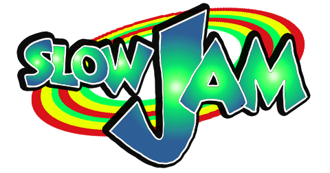
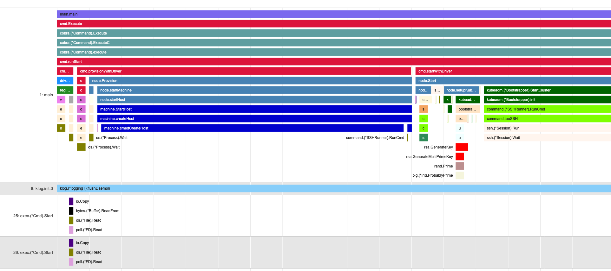

# 

`NOTE: This is not an officially supported Google product`

SlowJam is a tool for analyzing the performance of Go applications which consume substantial wall-clock time, but do not consume substantial CPU time. For example, an automation tool which primarily waits on command-line execution or remote resources to become available.

Go has great profiling and tracing support for applications which consume many resources, but does not have a low-touch story for profiling applications that primarily wait on external resources.

## Features

* Stack-based sampling approach
* Minimal instrumentation (2 lines of code to integrate)
* Minimal & tunable overhead (~1% for the small workloads we have tested)
* Hybrid Gantt/Flamegraph visualization

## Screenshot



See `example/minikube.html` for example output.

## Requirements

* Go v1.14 or higher

## Usage

## Recording

SlowJam contains a package named `stacklog`, which includes the minimal code required to record data for analysis. The simplest way to get started is invoking this in the `main()` method of your binary. This tells the stack logger to run in a default configuration if STACKLOG_PATH is set in the environment, and will record data to that location.

```go
s := stacklog.MustStartFromEnv("STACKLOG_PATH")
defer s.Stop()
```

If you prefer greater control over the configuration, you can also use:

```go
s, err := stacklog.Start(stacklog.Config{Path: os.Getenv("STACKLOG_PATH")})
defer s.Stop()
```

By default, this will poll the stack every 125ms.

## Visualization

Install slowjam:

`go install github.com/google/slowjam/cmd/slowjam`

Analyze a stacklog using the interactive webserver:

```shell
slowjam -http localhost:8080 /path/to/stack.slog
```

To output HTML:

```shell
slowjam -html out.html /path/to/stack.slog
```

## Real World Example

SlowJam was built to make [minikube](http://minikube.sigs.k8s.io/) go faster. Here's an example PR to integrate SlowJam analysis into minikube: https://github.com/kubernetes/minikube/pull/8329

What we were able to discover with SlowJam were:

* Things which we expected to be fast (<1s) were slow (10s)
* Things which could obviously be run in parallel were not

In all, we were able to speed minikube start up by about 3X by using SlowJam to analyze what it was waiting on.
