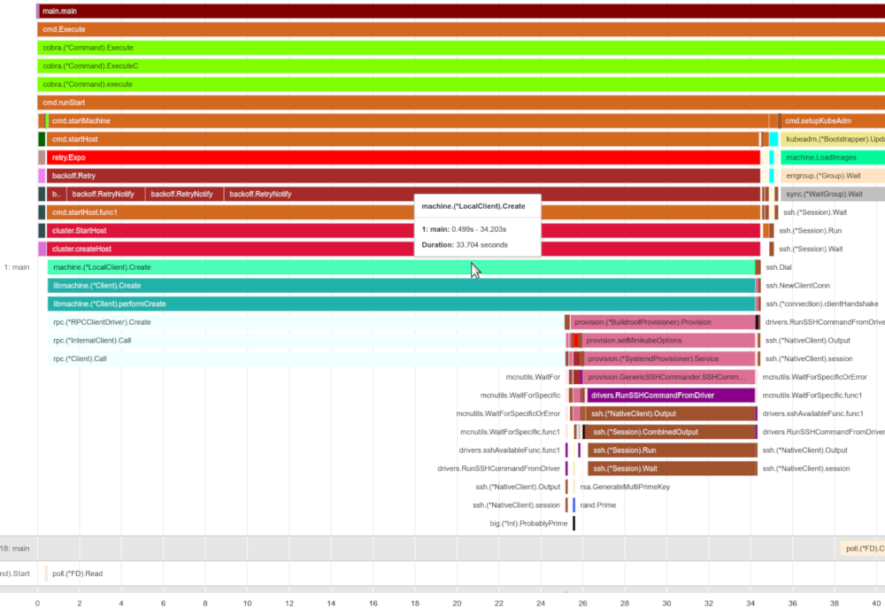

# slowjam

`NOTE: This is not an officially supported Google product`

SlowJam is a tool for analyzing the performance of Go applications which consume substantial wall-clock time, but do not consume substantial CPU time. For example, an automation tool which primarily waits on command-line execution or remote resources to become available.

Go has great profiling and tracing support for applications which consume many resources, but does not have a low-touch story for profiling applications that primarily wait on external resources.

# Features

* Stack-based sampling approach
* Minimal instrumentation (2 lines of code to integrate)
* Minimal & tunable overhead (~1% for the small workloads we have tested)
* Hybrid Gantt/Flamegraph visualization

# Screenshot



See `example/minikube.html` for example output.

# Requirements

* Go v1.14 or higher

# Usage

## Recording

Embed this snippet into a program, preferably guarded by a flag:

```go
s, err := stacklog.Start(stacklog.Config{})
defer s.Stop()
```

By default, this will poll the stack every 125ms, recording it to `stack.log`

## Visualization

```shell
go run cmd/timeline/timeline.go </path/to/stack.log>
```

This will start a webserver on port 8000 with a visualization.
